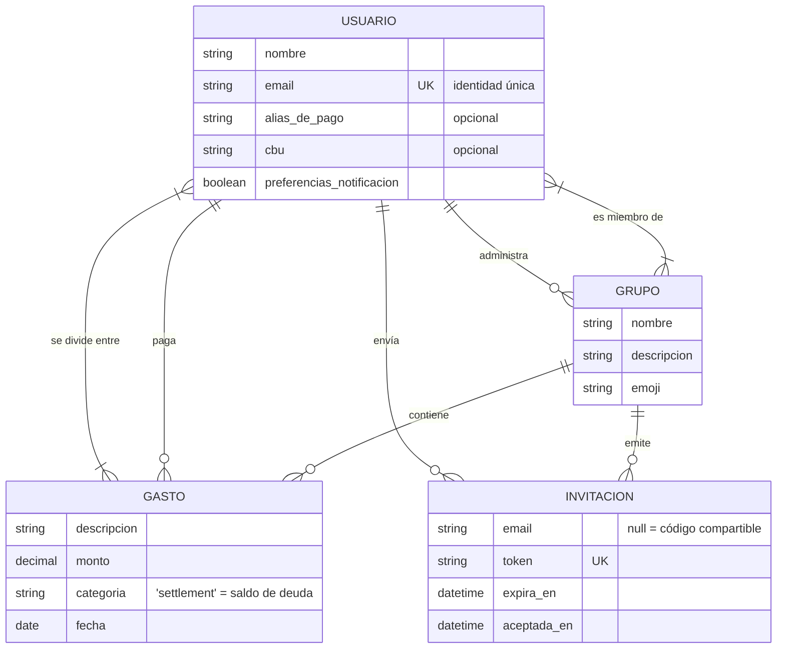
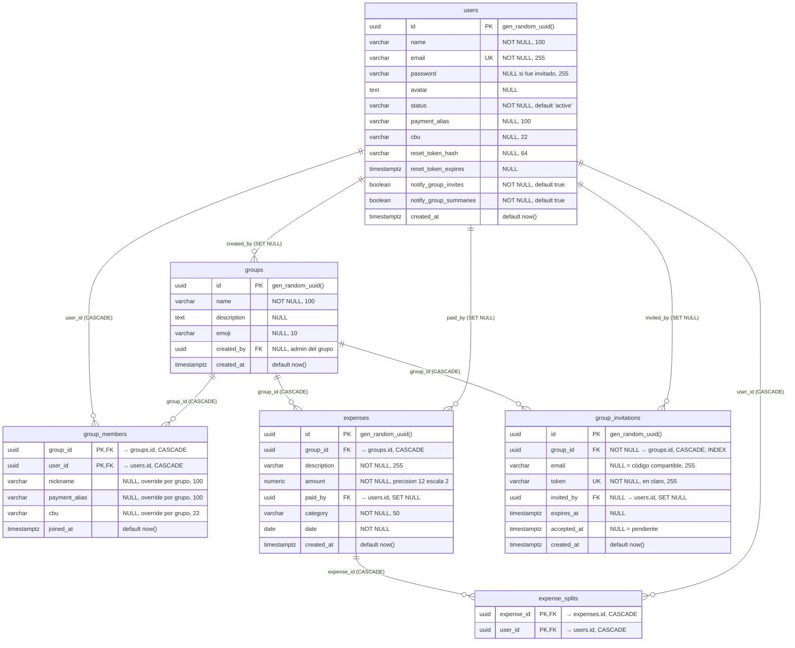

# Modelo de datos — Splitio

Motor: **PostgreSQL**. Acceso vía **Knex** (query builder, no ORM). El esquema se
construye con las migraciones de `backend/migrations/` (001 a 013); este documento
refleja el estado acumulado tras aplicarlas todas.

- [1. Diagrama entidad-relación (conceptual)](#1-diagrama-entidad-relación-conceptual)
- [2. Diagrama de base de datos (físico)](#2-diagrama-de-base-de-datos-físico)
- [3. Referencia de tablas](#3-referencia-de-tablas)
- [4. Reglas de negocio fuera del esquema](#4-reglas-de-negocio-fuera-del-esquema)
- [5. Observaciones](#5-observaciones)

---

## 1. Diagrama entidad-relación (conceptual)

Vista de negocio: cuatro entidades y sus vínculos. Las relaciones N:M se muestran
como relaciones, no como tablas — no aparecen claves foráneas ni tablas puente.

**Cardinalidades y participación**

| Relación | Cardinalidad | Notas |
|---|---|---|
| Usuario **es miembro de** Grupo | N:M | Atributos propios de la relación: `joined_at` y los overrides por grupo (`nickname`, `payment_alias`, `cbu`). Máximo 10 usuarios por grupo. |
| Usuario **administra** Grupo | 1:N | Un grupo tiene un solo administrador: su creador. Opcional del lado del grupo (queda en `null` si se borra el usuario). |
| Grupo **contiene** Gasto | 1:N | Un gasto pertenece a exactamente un grupo. |
| Usuario **paga** Gasto | 1:N | Quien adelantó el dinero. |
| Gasto **se divide entre** Usuario | N:M | Los participantes entre los que se reparte el monto. Un gasto tiene al menos uno. |
| Grupo **emite** Invitación | 1:N | Personales (con email) o código compartible (sin email). |
| Usuario **envía** Invitación | 1:N | Opcional: se conserva la invitación aunque se borre quien invitó. |

---

## 2. Diagrama de base de datos (físico)

Vista de implementación: seis tablas con columnas, tipos, claves e integridad
referencial. `group_members` y `expense_splits` son las tablas puente que
materializan las dos relaciones N:M del modelo conceptual.

> `PK,FK` marca las columnas que son a la vez parte de la clave primaria compuesta
> y clave foránea.

---

## 3. Referencia de tablas

### `users` — migraciones 001, 006, 007, 008, 010, 011

| Columna | Tipo | Nulo | Default | Notas |
|---|---|---|---|---|
| `id` | `uuid` | no | `gen_random_uuid()` | PK |
| `name` | `varchar(100)` | no | — | |
| `email` | `varchar(255)` | no | — | **UNIQUE**. Los invitados sin cuenta llevan un placeholder `@placeholder.local` que la API sanea a `null` (`utils/placeholderEmail.js`) |
| `password` | `varchar(255)` | **sí** | — | Hash bcrypt. `null` hasta que un usuario invitado completa el registro (migración 006) |
| `avatar` | `text` | sí | — | Ruta al archivo subido |
| `status` | `varchar(20)` | no | `'active'` | Distingue usuarios activos de invitados pendientes |
| `payment_alias` | `varchar(100)` | sí | — | Alias de pago global |
| `cbu` | `varchar(22)` | sí | — | CBU/CVU global |
| `reset_token_hash` | `varchar(64)` | sí | — | Hash del token de recupero, nunca el token en claro |
| `reset_token_expires` | `timestamptz` | sí | — | |
| `notify_group_invites` | `boolean` | no | `true` | |
| `notify_group_summaries` | `boolean` | no | `true` | |
| `created_at` | `timestamptz` | sí | `now()` | |

### `groups` — migración 002

| Columna | Tipo | Nulo | Default | Notas |
|---|---|---|---|---|
| `id` | `uuid` | no | `gen_random_uuid()` | PK |
| `name` | `varchar(100)` | no | — | |
| `description` | `text` | sí | — | |
| `emoji` | `varchar(10)` | sí | — | |
| `created_by` | `uuid` | sí | — | FK → `users.id` **ON DELETE SET NULL**. Define al administrador |
| `created_at` | `timestamptz` | sí | `now()` | |

### `group_members` — migraciones 003, 009

Tabla puente de la relación N:M usuario–grupo, con atributos propios.

| Columna | Tipo | Nulo | Default | Notas |
|---|---|---|---|---|
| `group_id` | `uuid` | no | — | **PK compuesta**, FK → `groups.id` **CASCADE** |
| `user_id` | `uuid` | no | — | **PK compuesta**, FK → `users.id` **CASCADE** |
| `nickname` | `varchar(100)` | sí | — | Override del nombre solo dentro de este grupo |
| `payment_alias` | `varchar(100)` | sí | — | Override del alias solo dentro de este grupo |
| `cbu` | `varchar(22)` | sí | — | Override del CBU solo dentro de este grupo |
| `joined_at` | `timestamptz` | sí | `now()` | |

La PK compuesta `(group_id, user_id)` garantiza que un usuario no pueda estar
duplicado en un mismo grupo.

### `expenses` — migraciones 004, 013

| Columna | Tipo | Nulo | Default | Notas |
|---|---|---|---|---|
| `id` | `uuid` | no | `gen_random_uuid()` | PK |
| `group_id` | `uuid` | sí | — | FK → `groups.id` **CASCADE** |
| `description` | `varchar(255)` | no | — | |
| `amount` | `numeric(12,2)` | no | — | El driver `pg` lo devuelve como **string**, no como number |
| `paid_by` | `uuid` | sí | — | FK → `users.id` **ON DELETE SET NULL** (migración 013). Quien adelantó el dinero |
| `category` | `varchar(50)` | no | — | `'settlement'` marca un saldo de deuda, no un gasto real |
| `date` | `date` | no | — | Fecha del gasto (distinta de `created_at`) |
| `created_at` | `timestamptz` | sí | `now()` | |

### `expense_splits` — migración 005

Tabla puente de la relación N:M gasto–usuario. Sin columnas extra: el reparto es
siempre en partes iguales entre los participantes listados.

| Columna | Tipo | Nulo | Default | Notas |
|---|---|---|---|---|
| `expense_id` | `uuid` | no | — | **PK compuesta**, FK → `expenses.id` **CASCADE** |
| `user_id` | `uuid` | no | — | **PK compuesta**, FK → `users.id` **CASCADE** |

### `group_invitations` — migración 012

| Columna | Tipo | Nulo | Default | Notas |
|---|---|---|---|---|
| `id` | `uuid` | no | `gen_random_uuid()` | PK |
| `group_id` | `uuid` | no | — | FK → `groups.id` **CASCADE**, con índice |
| `email` | `varchar(255)` | sí | — | Con valor ⇒ invitación personal de un solo uso. `null` ⇒ código compartible reusable |
| `token` | `varchar(255)` | no | — | **UNIQUE**, guardado en claro para poder re-mostrar el enlace. Mitigado con expiración y revocación |
| `invited_by` | `uuid` | sí | — | FK → `users.id` **SET NULL** |
| `expires_at` | `timestamptz` | sí | — | |
| `accepted_at` | `timestamptz` | sí | — | `null` ⇒ pendiente |
| `created_at` | `timestamptz` | sí | `now()` | |

---

## 4. Reglas de negocio fuera del esquema

Restricciones que la base **no** impone y que dependen del código de aplicación:

| Regla | Dónde vive |
|---|---|
| Máximo 10 miembros por grupo (incluido el creador) | `MAX_GROUP_MEMBERS` en `backend/src/utils/invitations.js`, validado en `group.create`, `addMember` e `invitation.accept` |
| El administrador del grupo es su creador | `isGroupAdmin()` en `backend/src/utils/authorization.js`, comparando contra `groups.created_by` |
| Los saldos de deuda se guardan como gastos con `category = 'settlement'` | `expenseController.settle`; casi todas las agregaciones los filtran |
| Un gasto debe tener al menos un participante en `expense_splits` | Validadores de `express-validator` + `expenseController` |
| El email placeholder `@placeholder.local` nunca se expone en la API | `sanitizeUserEmail()` en `backend/src/utils/placeholderEmail.js` |

---

## 5. Observaciones

**`expenses.paid_by` — corregido en la migración 013.** Se creó sin `ON DELETE`
(migración 004), por lo que PostgreSQL aplicaba `NO ACTION` y borrar un usuario
que hubiera pagado algún gasto fallaba con violación de FK. Ahora es `SET NULL`,
alineado con `groups.created_by` y `group_invitations.invited_by`: el gasto
sobrevive al borrado y el historial del grupo queda intacto.

Consecuencia a tener presente: con `paid_by` en `null`, el cálculo de balances
descarta el crédito de ese gasto (`groupController.js:340` guarda con
`if (balanceMap[expense.paid_by])`) mientras sigue debitando a los participantes
que continúan en el grupo, así que los balances del grupo dejan de sumar cero.
No es una regresión de la migración 013 — es el mismo comportamiento que ya
existe hoy al quitar a un miembro de un grupo vía
`DELETE /groups/:id/members/:userId`, porque `balanceMap` se arma solo con los
miembros actuales. Si alguna vez se agrega borrado de usuarios, ese caso merece
una decisión explícita de producto (reasignar el gasto, anonimizar el usuario en
lugar de borrarlo, o recalcular).

**`expenses.group_id` admite `null`.** La migración 004 no la marca
`notNullable()`, a diferencia de `group_invitations.group_id`. Un gasto huérfano
de grupo no tiene sentido en el dominio y no aparecería en ninguna consulta de
balances.

**Sin `updated_at` en ninguna tabla.** Solo se registra `created_at`. Relevante si
alguna vez se migra a un ORM que asume ambas columnas por convención.

**Sin índices más allá de los automáticos.** Solo existen los de PK, los `UNIQUE`
(`users.email`, `group_invitations.token`) y el índice explícito sobre
`group_invitations.group_id`. Las FK más consultadas —`expenses.group_id`,
`expense_splits.expense_id`, `group_members.user_id`— no tienen índice propio;
PostgreSQL **no** los crea automáticamente para claves foráneas. A la escala
actual no molesta, pero es lo primero a revisar si las consultas de balances se
vuelven lentas.
