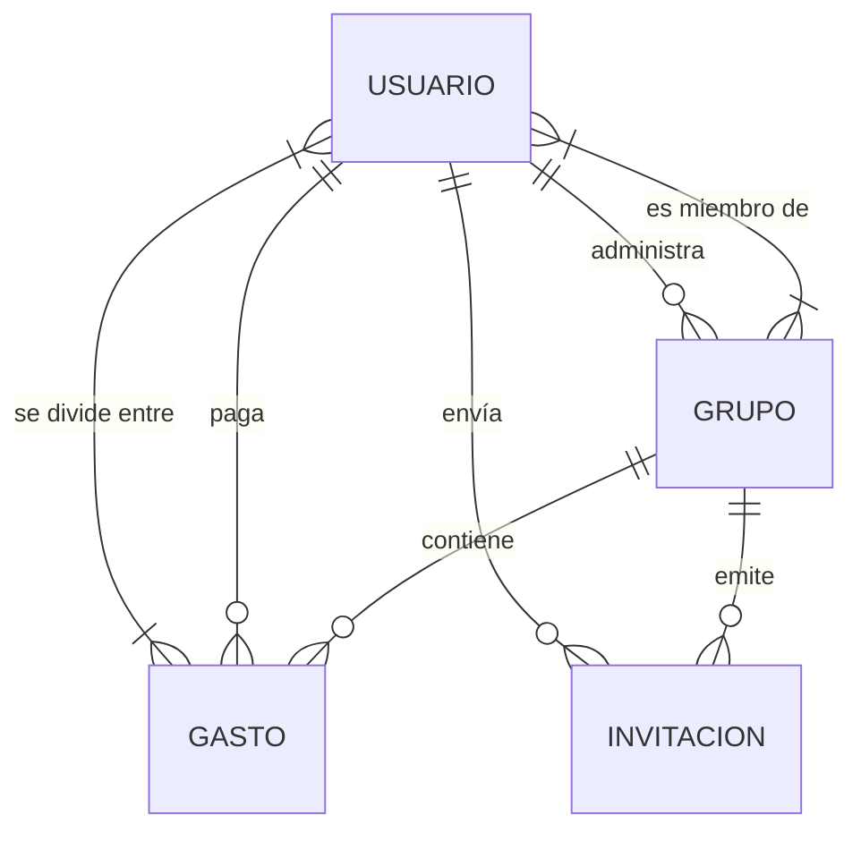

# Splitio

Aplicación web para registrar y saldar gastos compartidos entre grupos de
personas: quién pagó qué, cómo se reparte y quién le debe a quién.

Calcula los balances de cada integrante y reduce las deudas al mínimo número de
transferencias posibles, para que en vez de seis pagos cruzados el grupo cierre
con dos.

---

## Contenido

- [Características](#características)
- [Stack](#stack)
- [Estructura](#estructura)
- [Requisitos](#requisitos)
- [Puesta en marcha](#puesta-en-marcha)
- [Variables de entorno](#variables-de-entorno)
- [Scripts](#scripts)
- [API](#api)
- [Modelo de datos](#modelo-de-datos)
- [Rutas del frontend](#rutas-del-frontend)
- [Licencia](#licencia)

---

## Características

**Grupos**
- Creación de grupos con nombre, descripción y emoji identificatorio.
- Hasta 10 integrantes por grupo (incluido el creador).
- El creador es el administrador y es quien puede generar o revocar códigos de invitación.
- Apodo, alias de pago y CBU configurables **por grupo**, además de los globales del perfil.

**Invitaciones**
- Invitación personal por email, de un solo uso.
- Código compartible reusable, con expiración y revocación.
- Los invitados que todavía no tienen cuenta quedan registrados como pendientes y se activan al completar el registro.

**Gastos**
- Alta de gastos con descripción, monto, categoría, fecha y pagador.
- Reparto entre los integrantes que se elijan, no necesariamente todo el grupo.
- Registro de saldos de deuda (`settlements`) para marcar pagos ya realizados.

**Balances**
- Balance neto por integrante: cuánto puso de más o de menos.
- Cálculo de deudas minimizadas mediante emparejamiento de acreedores y deudores.
- Resumen del grupo descargable en PDF o enviado por email.

**Cuentas**
- Registro y login con JWT (access token de 15 min + refresh token de 7 días).
- Recupero de contraseña por email, con token hasheado y expiración.
- Avatar subible, alias de pago y CBU en el perfil.
- Preferencias de notificación por email (invitaciones y resúmenes).
- Tema claro/oscuro persistido.

---

## Stack

| | |
|---|---|
| **Frontend** | React 19, Vite 8, Tailwind CSS 4, Zustand 5, React Router 7, ApexCharts, Sonner |
| **Backend** | Node.js, Express 5, Knex 3 (query builder), PostgreSQL, JWT, bcrypt |
| **Servicios** | Resend (emails), PDFKit (resúmenes en PDF), Multer (subida de avatares) |
| **Docs** | OpenAPI 3.0 + Swagger UI |

---

## Estructura

```
split_expenses/
├── backend/
│   ├── migrations/       # Migraciones Knex (001 a 013)
│   ├── seeds/            # Datos de ejemplo
│   ├── src/
│   │   ├── config/       # Instancia de Knex
│   │   ├── controllers/  # Lógica de cada recurso
│   │   ├── docs/         # Spec OpenAPI
│   │   ├── middleware/   # Auth JWT, subida de avatares, manejo de errores
│   │   ├── routes/       # auth, users, groups, expenses, invitations
│   │   ├── services/     # Email (Resend) y generación de PDF
│   │   ├── utils/        # Autorización, invitaciones, helpers
│   │   ├── validators/   # Reglas de express-validator
│   │   └── index.js      # Entrypoint
│   └── knexfile.js
├── frontend/
│   └── src/
│       ├── api/          # Cliente fetch con refresh automático de token
│       ├── components/
│       ├── pages/
│       ├── router/
│       ├── stores/       # Estado global con Zustand
│       └── utils/        # Cálculo de balances y deudas
└── DATABASE.md           # Diagramas y referencia del esquema
```

Arquitectura del backend en capas: `routes → validators → controllers → knex`.

---

## Requisitos

- **Node.js 20+** (Vite 8 requiere 20.19+ o 22.12+)
- **PostgreSQL 13+**
- Una cuenta de [Resend](https://resend.com) si querés que se envíen los emails
  (opcional: sin la API key la app funciona igual y omite el envío).

---

## Puesta en marcha

### 1. Clonar e instalar

```bash
git clone <url-del-repo>
cd split_expenses

cd backend && npm install
cd ../frontend && npm install
```

### 2. Crear la base de datos

```bash
createdb split_expenses
```

### 3. Configurar el backend

```bash
cd backend
cp .env.example .env
```

Editá `.env` con tus credenciales de PostgreSQL y, como mínimo, completá
`JWT_SECRET` y `JWT_REFRESH_SECRET` (vienen vacíos y la app no arranca bien sin
ellos). Podés generarlos con:

```bash
node -e "console.log(require('crypto').randomBytes(32).toString('hex'))"
```

Ver la [tabla completa de variables](#variables-de-entorno) para el detalle de
cada una.

### 4. Migrar la base

```bash
cd backend
npm run migrate       # crea el esquema
npm run seed          # opcional: datos de ejemplo
```

### 5. Levantar ambos servidores

En dos terminales:

```bash
cd backend && npm run dev     # API en http://localhost:3001
```

```bash
cd frontend && npm run dev    # App en http://localhost:5173
```

El dev server de Vite proxea `/api` y `/uploads` al backend, así que no hace
falta configurar nada más para desarrollo local.

---

## Variables de entorno

Todas se leen en `backend/.env`. El frontend no necesita ninguna.

| Variable | Requerida | Default | Descripción |
|---|---|---|---|
| `JWT_SECRET` | **sí** | — | Firma de los access tokens (15 min) |
| `JWT_REFRESH_SECRET` | **sí** | — | Firma de los refresh tokens (7 días) |
| `DB_HOST` | sí | `localhost` | |
| `DB_PORT` | sí | `5432` | |
| `DB_NAME` | sí | `split_expenses` | |
| `DB_USER` | sí | `postgres` | |
| `DB_PASSWORD` | sí | `postgres` | |
| `DATABASE_URL` | solo producción | — | String de conexión completo; tiene prioridad sobre las `DB_*` cuando `NODE_ENV=production` |
| `NODE_ENV` | no | `development` | Selecciona la configuración de `knexfile.js` |
| `PORT` | no | `3001` | Puerto del backend |
| `CORS_ORIGIN` | no | `FRONTEND_URL`, o `http://localhost:5173` | Origen permitido por CORS |
| `FRONTEND_URL` | no | `http://localhost:5173` | Base de los enlaces que se envían por email |
| `RESEND_API_KEY` | no | — | Sin ella, los envíos se omiten con un warning en consola y el resto de la app funciona |
| `EMAIL_FROM` | no | `Splitio <onboarding@resend.dev>` | Remitente de los emails |

`backend/.env.example` incluye todas estas variables, comentadas y con los
valores de desarrollo por defecto ya cargados.

---

## Scripts

### Backend (`cd backend`)

| Comando | Descripción |
|---|---|
| `npm run dev` | Servidor con recarga automática (nodemon) |
| `npm start` | Servidor en modo producción |
| `npm run migrate` | Aplica las migraciones pendientes |
| `npm run migrate:rollback` | Revierte el último lote de migraciones |
| `npm run seed` | Carga los datos de ejemplo |

### Frontend (`cd frontend`)

| Comando | Descripción |
|---|---|
| `npm run dev` | Dev server de Vite en el puerto 5173 |
| `npm run build` | Build de producción a `dist/` |
| `npm run preview` | Sirve el build de producción |
| `npm run lint` | ESLint |

---

## API

Base: `/api`. Todos los endpoints requieren el header
`Authorization: Bearer <access_token>` salvo los marcados como públicos.

Con el backend levantado, la documentación interactiva queda en
**http://localhost:3001/api/docs** y el spec crudo en `/api/docs.json`.

### Autenticación — `/api/auth` (público, límite de 10 req / 15 min)

| Método | Ruta | Descripción |
|---|---|---|
| `POST` | `/register` | Crear cuenta |
| `POST` | `/login` | Iniciar sesión |
| `POST` | `/refresh` | Renovar el access token |
| `POST` | `/forgot-password` | Solicitar el email de recupero |
| `POST` | `/reset-password` | Definir la nueva contraseña con el token |

### Usuarios — `/api/users`

| Método | Ruta | Descripción |
|---|---|---|
| `GET` | `/` | Usuarios con los que compartís algún grupo |
| `GET` | `/me` | Perfil propio |
| `PUT` | `/me` | Actualizar el perfil propio |
| `POST` | `/me/avatar` | Subir avatar |
| `DELETE` | `/me/avatar` | Eliminar avatar |
| `GET` | `/:id` | Ver un usuario |
| `PUT` | `/:id` | Actualizar un usuario |

### Grupos — `/api/groups`

| Método | Ruta | Descripción |
|---|---|---|
| `GET` `POST` | `/` | Listar y crear grupos |
| `GET` `PUT` `DELETE` | `/:id` | Ver, editar y eliminar un grupo |
| `GET` `POST` | `/:id/members` | Listar y agregar integrantes |
| `PUT` `DELETE` | `/:id/members/:userId` | Editar overrides y quitar a un integrante |
| `GET` | `/:id/balances` | Balances y deudas minimizadas |
| `POST` | `/:id/summary` | Enviar el resumen por email |
| `GET` | `/:id/summary/pdf` | Descargar el resumen en PDF |
| `GET` `POST` | `/:id/invitations` | Listar invitaciones e invitar por email |
| `DELETE` | `/:id/invitations/:invitationId` | Revocar una invitación |
| `GET` | `/:id/invite-code` | Ver el código compartible |
| `POST` `DELETE` | `/:id/invite-code` | Generar y revocar el código (solo admin) |

### Gastos — `/api/expenses`

| Método | Ruta | Descripción |
|---|---|---|
| `GET` `POST` | `/` | Listar y crear gastos |
| `POST` | `/settle` | Registrar un saldo de deuda |
| `GET` `DELETE` | `/:id` | Ver y eliminar un gasto |

### Invitaciones — `/api/invitations`

| Método | Ruta | Descripción |
|---|---|---|
| `GET` | `/:token` | Vista previa de la invitación (**público**) |
| `POST` | `/:token/accept` | Aceptar la invitación y unirse al grupo |

---

## Modelo de datos

Seis tablas en PostgreSQL con claves primarias UUID.



Dos detalles de implementación que conviene saber al leer el código:

- Los saldos de deuda se guardan como gastos con `category = 'settlement'`; la
  mayoría de las agregaciones los filtran.
- El límite de 10 integrantes por grupo vive en `MAX_GROUP_MEMBERS`
  (`backend/src/utils/invitations.js`) y se valida en el backend, no solo en la UI.

---

## Rutas del frontend

| Ruta | Acceso | Página |
|---|---|---|
| `/login` | público | Iniciar sesión |
| `/register` | público | Crear cuenta |
| `/forgot-password` | público | Solicitar recupero de contraseña |
| `/reset-password` | público | Definir nueva contraseña |
| `/invitacion/:token` | público | Aceptar una invitación |
| `/` | privado | Dashboard |
| `/grupos` | privado | Listado de grupos |
| `/grupos/:id` | privado | Detalle del grupo |
| `/gastos` | privado | Listado de gastos |
| `/balances` | privado | Balances y deudas |
| `/perfil` | privado | Perfil y preferencias |

---

## Licencia

ISC, según lo declarado en `backend/package.json`. El repositorio todavía no
incluye un archivo `LICENSE`.
